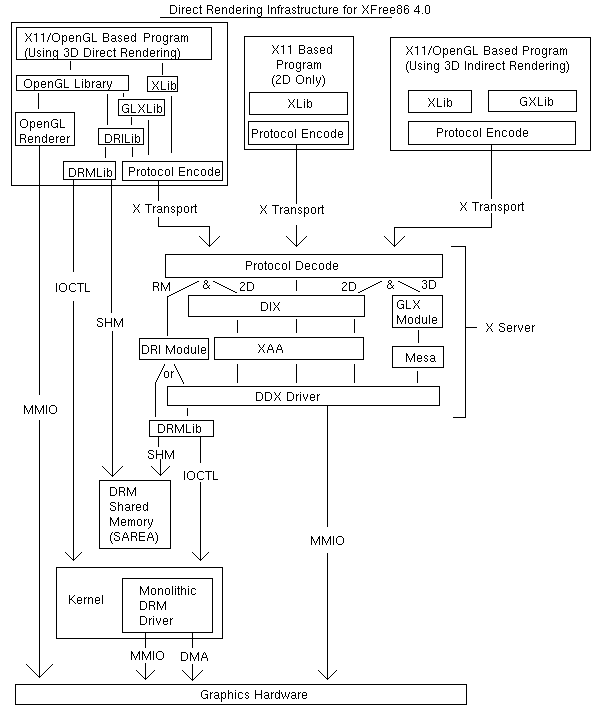
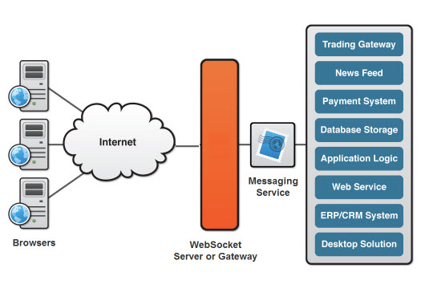

# Xjs 调研报告

[TOC]

## 项目成员

刘紫檀 (Zitan Liu)(**Group leader**)

张博文 (Bowen Zhang)

虞佳焕 (Jiahuan Yu)

汤兖霖 (Yanlin Tang)

## 项目简介

本项目意在实现一个主要基于浏览器 Javascript 的 X Server，用来提供一种更流畅的远程桌面方案。

## 项目背景

目前直接利用 Web 方案下的远程桌面大多是基于帧传输，无法如`Xming`等基于 X11 协议的 X Server 程序一样提供近似原生桌面的帧率体验和操作感受。

同时，随着计算机系统性能和浏览器图形图像渲染能力的提升，我们认为，可以通过将要绘制内容的**方法**而不是**结果**实时回传，从而降低延迟，提高帧率，实现更流畅的 Web 远程桌面体验。

## 立项依据

我们调研了用于实现 Web 上动态绘图和双工传输的常见组件，以及常见的远程桌面与 X 的解决方案。下面将逐一进行介绍。

### RDP

RDP（*Remote Desktop Protocol*），是微软开发的一个专有远程桌面协议。

据[RDP @ Wikipedia](https://en.wikipedia.org/wiki/Remote_Desktop_Protocol)介绍，RDP 是基于「行为」而非基于帧的；但由于文档缺乏，刘紫檀同学没能考证。可以详见[rdesktop](https://github.com/rdesktop/rdesktop)中关于 RDP 的实现。

### VNC


### 简介

VNC (Virtual Network Computing) 为一种使用 RFB 协议的屏幕画面分享及远程操作软件，通过网络，可发送键盘与鼠标的动作及即时的屏幕画面。

### 历史与现状

VNC 由 Olivetti & Oracle 研究室所开发，此研究室在1999年并入 AT&T。AT&T 于2002年中止了此研究室的运作，并把 VNC 以 GPL 发布。

原来的 AT&T 版本已经不再使用，因为更多有重大改善的分支版本已经出现，他们具有全面的向后兼容。由于 VNC 以 GPL 授权，派生出了几个 VNC 软件：

- RealVNC：由VNC团队部分成员开发，分为全功能商业版及免费版。
- TightVNC：强调节省带宽使用。
- UltraVNC：加入了 TightVNC 的部分程序及加强性能的图型映射驱动程序，并结合 Active Directory 及 NTLM 的账号密码认证，但仅有 Windows 版本。
- Vine Viewer：macOS 的 VNC Client.

这些软件各有所长，例如UltraVNC支持文件传输以及全屏模式。而这些软件间大多遵循基本的VNC协议，因此大多可互通使用。

Windows Server 中包含的 Terminal Server、Symantec 公司开发的收费软件 PCAnywhere、流行的 Teamviewer 的设计原理和 VNC 相似，同时这些软件又在 VNC 的原理基础上做了各自相应改进，提高了易用性、连通率，也提供了可穿透内网的特性。

### 原理

VNC 系统由 Client, Server 和一个协议组成。

<div align="center">

</div>

VNC 的 Server 目的是分享其所运行机器的屏幕， Server 被动的允许 Client 控制它。VNC Client 观察、控制 Server, 与 Server 交互。VNC 协议 RFB 是一个简单的协议，传送 Server 的原始图像到 Client （一个 X,Y 位置上的正方形的点阵数据），Client 传送事件消息到 Server。

Server 发送小方块的帧缓存给 Client，在最简单的情况，VNC协议使用大量的带宽，因此各种各样的方法被发明出来减少通讯的开支，举例来说，有各种各样的编码方法来决定最有效率的方法来传送这些点阵方块。

协议允许 Client 和 Server 协商使用哪种编码。最简单的编码，即被所有 Client 和 Server 所支持的是，从左到右的像素扫描数据的原始编码，当原始的屏幕数据被发送后，只发送变化的方块区域。这种编码在帧间只有小部分屏幕变化的情况下工作得非常好（像是鼠标键在桌面移动的情况，或在光标处敲击文字），不过如果大量的像素同时变化，带宽消耗将会增加得非常高，例如拖动一个窗口或观看全屏视频。

VNC 默认使用 TCP 端口5900至5906。一个 Server 可以在5900端口用“监听模式”连接一个 Client, 使用“监听模式”的一个好处是 Server 不需要设置防火墙。

**UNIX 上的 VNC 称为 xvnc，同时扮演两种角色：对 X Window System 的应用程序来说它是 X Server，对于 VNC Client 来说它是 VNC Server.**

<div align="center">

</div>

### 优点

- VNC Client 不储存任何状态信息，使得在任何地方连接到 VNC Server 时都可以得到完全一致的状态。
- VNC Client 是平台无关的，在各个平台上的使用体验一致，可用于数量庞大的不同操作系统。多平台的支持对网络管理员是十分重要的，这使得网络管理员可以使用一种工具管理几乎所有系统。
- VNC 是免费的，它的简单，可靠，和向后兼容性，使之进化成为最为广泛使用的远程控制软件，

### 缺陷

- 带宽占用大，对于动态内容较多的画面，会有明显的延迟和帧率下降。
- VNC 对于简单的远程控制几乎完美，但是缺少对于大机构的桌面帮助功能，主要是日志记录和安全功能无法满足对大机构的桌面帮助功能。
- 因为 VNC 本来是开发用在局域网的环境，因此用在互联网上存在安全问题。不过 VNC 可设计以 SSH 或 VPN 传输，以增加安全性。有些 VNC 软件，如 UltraVNC，更进一步支持 Active Directory 及 NTLM 的账号密码认证。

### VNC, XVNC 与 X11VNC

XVNC 同时具有 X Server 和 VNC Server 的功能。可以在没有物理显示器的情况下渲染 X System 的画面，并使用与一般 VNC 一致的技术手段传送给 VNC Client.

X11VNC 仅抓取正在运行的 X System 的画面，自身并没有渲染的功能，和 VNC 没有实质性的区别，但对进行了安全强化，引入了 SSL 连接等实用的安全特性。

### VNC 的有关改进

#### 1. 提高客户端屏幕显示的帧率

作为一款远程桌面的产品，影响用户体验最重要的因素都是屏幕画面的流畅程度。因此，提高客户端上屏幕显示的帧率就至关重要。

##### 1.1 屏幕更新策略

屏幕更新策略主要涉及到下面两个问题：

- Server 端如何检测出屏幕画面发生了变化并生成显示更新？
- Server 端何时将显示更新发送到 Client 端？

下面就对这两个问题进行一个简单的分析：

###### 1.1.1 显示更新的生成

这个问题的本质其实是显示更新与当前系统窗口系统的绘图命令之间的关系。在 Server 端可以采用来两种策略来生成显示更新：

- 积极更新策略（Eager display update）
- 懒惰更新策略（Lazy display update）

在积极更新策略中，一旦窗口系统发出新的图形命令,Server 端都立刻生成该命令对应的显示更新。

而在懒惰更新策略中，窗口系统产生的图形命令会被首先放入一个中间队列,以检测各条命令所更改的区域是否存在重合，在存在重合的情况下将对相关命令进行合并后为其生成显示更新。

懒惰更新由于可以对多个显示更新进行合并，在带宽利用上更有优势。然而懒惰更新并不适用于对交互性要求较高的应用。

###### 1.1.2 显示更新的驱动模式

显示更新的驱动模式指的就是何时将 Server 端的显示更新发送到 Client 端，这里存在两种显示更新的驱动模式：

- 服务端主动推送（Server-Push）
- 客户端主动拉取（Client-Pull）

在 Server-Push 的模式中，由 Server 端决定何时将生成的显示更新发送到 Client 端。而在 Client-Pull 模式中，Client 端在需要显示更新时向 Server 端发送请求，驱动着 Server 端返回更新。

Client-Pull 模式的优势在于它是一种简单且易于实现的模式，并且整个系统具备一定的自适应能力，Client 端能够根据自身处理能力、网络状况对发送请求的频率进行调整。

#### 1.2 VNC 中的屏幕更新策略

在 VNC 中实现的屏幕更新策略是客户端主动拉取式的懒惰更新策略。由于 VNC 是从 Framebuffer 层截获系统原始的屏幕像素数据，所以这一特点也决定了 VNC 只能采用懒惰的更新策略。而在显示更新驱动模式上，VNC 则采用了实现更为简单并能够根据网络状况来修改发送屏幕更新请求频率的客户端拉取的更新策略。

但是 Client-Pull 的显示更新驱动模式存在一个明显的缺陷：相邻的显示更新之间存在不可消除的时间间隔，如果在传输延迟比较大的情况下，Screen update time 的值就会变得很大，就会导致客户端屏幕显示的帧率下降出现卡顿的情况，用户体验变得很差。

#### 2. 改进图像修改区域检测算法

VNC 中的 RFB 协议所支持的屏幕像素数据的更新方法是一种增量式的数据更新方法。整个屏幕的像素数据被切分成一个个更小粒度的矩形块（我们将其称为检测矩形块），当 Client 端第一次发送 FramebufferUpdateRequest 给 Server 端时，Server 端会将 整个屏幕像素数据发送给 Client 端，而当 Client 端接下来再次发送 FramebufferUpdateRequest 消息时，Server 端只需要将与上一帧屏幕图像不同的作了修改的部分的矩形块进行压缩编码重传即可，这种方法有效地节省了数据地传输。

但是，计算屏幕图像修改区域需要花费额外的计算时间，因此，图像修改区域检测算法就是用来缩短这一段计算时间。修改区域检测算法所需要做的事情就是找出当前屏幕图像和上一帧图像之间存在差异的地方。

##### 2.1 传统的基于屏幕扫描顺序的检测算法

传统的图像修改区域检测算法是按照屏幕地扫描更新顺序（从左上角到右下角的顺序），依次对比当前帧图像和上一帧图像图像在同一个坐标位置的像素值，如果像素值不相同，那么则将这个像素点所在的矩形块标记为“脏矩形块”。

从这个检测算法的工作机制中我们就可以看出这种算法的工作效率不高，当修改了的像素点位于矩形块的右下角时，那么这个算法会对矩形块中的每个像素点做一个对比。因此，韩国的研究人员提出了下面的两种改进方案。

##### 2.2 分层修改区域检测算法

这个算法的核心思想就是使用不同大小的采样矩形来检测采样矩形中是否存在相对于上一帧图像做了修改了的像素点，由于整个算法是按照二维进行展开搜索的，它相对于传统的按照一维顺序扫描检测算法快地多。整个算法可以分为 3 个步骤:

- step 1 首先，矩形的长和宽分别被设置成检测矩形大小的 1/4，然后在这个小的采样矩形块中采用传统的按照屏幕扫描顺序来依次对比其中的像素点是否发生了变化，如果是，那么整个算法停止，当前的检测矩形块就被标记为“脏矩形块”。否则，算法就接着执行下面的 step 2。
- step 2 在这一步中，采样的矩形块的长宽分别被设置成检测矩形的 1/2，然后和 step 1 一样还是采用传统的按照屏幕扫描顺序来依次对比其中的像素点的方法来检测是否有像素点发生了变化。如果是，那么整个算法停止，当前的检测矩形块就被标记为“脏矩形块”。否则，算法就接着执行下面的 step 3。
- step 3 在这步中，采样的矩形块的长宽分别被设置成和检测矩形一样的大小，后面的像素点的比较算法就和 2.1 小节中描述的传统的像素点扫描检测算法相同。

如果这种算法能够在 step 1 和 step 2 两步中停止下来，那么该算法的的效率就会比 2.1 小节的传统检测算法高，否则直到 step 3 时算法才停止的话，该算法的效率就和传统的检测算法效率一样了。

##### 2.3 间隔扫描检测算法

这种算法的核心思想也非常简单，简单描述一下就是：先按照 1,3,5,7…… 这样的奇数顺序，按照传统的扫描检测算法来对指定位置的像素点的像素值依次比较，如果发现有像素点相对于上一帧图像发生了变化，那么算法就停止，当前的检测矩形块就被标记为“脏矩形块”。否则的话，下一轮扫描就是按照 2,4,6,8…… 这样的偶数顺序来进行检测，发现有像素点相对于上一帧图像发生了变化，那么算法就停止，当前的检测矩形块就被标记为“脏矩形块”。如果还是没有发现修改的像素点，那么这个检测矩形就不会被标记为“脏矩形块”，在后续的处理中就会被跳过。

#### 3. 压缩编码算法

我们知道 VNC 中传输的数据量最大的就是屏幕数据，当网络带宽有限时，屏幕数据从 Server 端传送到 Client 端就非常容易发生拥塞，导致客户的屏幕更新率降低。因此，减少 VNC 传输的数据量就变得非常重要。而想要减少 VNC 传输的数据量，就要依赖于一个好的压缩编码方法。

在 VNC 协议中已经内置了以下几种压缩编码的方法：

- Raw
- CopyRect
- RRE
- Hextile
- ZRLE

有关这些编码的具体含义，可以参考 RFB 协议中描述。

但是，由于上述几种压缩编码算法的压缩率和编码时间可能无法达到非常理想的状态，所以就有许多研究人员采用 Zlib、MPEG2、MPEG4、MJPEG 等库来对传输的图形数据进行压缩编码。

### X Window System

#### 概述

X Window System （下面简称为 X）是一个基于客户端/服务器模型的 GUI 框架，被广泛应用于 Unix 系统中。诸如 Chromium 这样的 GUI 软件作为 X 客户端，通过 X11 协议连接 X 服务器。典型的 X 服务器（如`Xorg`）负责根据 X 客户端的指示绘制图形，接收用户从键盘、鼠标的输入并且分发到对应的 X 客户端。

X 起源于1984年的 MIT 实验室。最新的 X 协议版本为 X11 Revision 7.7，但是 X11 的第一个版本早在1987年九月就已成型。X 提供了用于构建 GUI 程序的基本框架，例如处理哪个程序应该更新显示，以及鼠标键盘事件应该送往哪里。

不过，X 并没有关于界面本身的统一标准，而是把这种画界面的工作下放给了诸如 Gtk、Qt 等 Toolkit 来实现。这样做导致运行在 X 上的应用程序样式可谓五花八门。

X 的协议实现了网络透明，这意味着一个运行在另一台电脑上的 X 客户端程序可以连接到这台电脑的 X 服务器上来显示它的界面，并且可以和本地的 X 客户端程序达到相同的功能。这对于我们实现基于 Javascript 的浏览器端 X 服务器是极为有用的。

X 没有对音频系统的内建支持；对于音频系统，常用的组件是`PulseAudio`。`PulseAudio`是一个通用的 Linux 音频服务端软件。在此之下驱动声卡的系统组件则是`alsa`。

#### X 的设计哲学
在1984年，Bob Scheifler 和 Jim Gettys 提出了 X 的早期设计哲学：
- 不到实现者没法实现功能的程度，就不要添加新功能。
- 决定系统「不是什么」和决定它「是什么」一样重要。不要尝试去满足所有需求，而应该让系统有良好的扩展性，这样其它需求就可以用向上兼容的扩展来达到。
- 没有什么比只从一个孤例总结观点更糟了。如果有，那就是一个例子也没有的总结。
- 如果可以用 10% 的工作完成 90% 的事情，那就这样做。
- 尽可能隔离复杂性。
- 提供「机制」而非「策略」。特别地，把用户界面的实现策略交给客户端手上。

在 X11 时第一条变成了「如果你不知道有什么实际的应用场景，就不要添加新功能」。

X 贯彻这些哲学贯彻的非常彻底。渲染和窗口管理上的变动基本通过添加扩展实现，而协议本身仍然与1987年的 X11 保持兼容。

#### X 的缺陷和取代 X 的尝试

X 基于的客户端/服务器架构隔离了不同硬件和不同设备带来的复杂性，但是也降低了程序运行速度，增大了图形界面的开销。同时，X11 本身没有对一个程序抓取另一个程序的输入事件的行为作出限制，这带来了一些安全上的问题。

X 的竞争者主要为`Wayland`。`Wayland`相比于 X 有如下优势：

- Wayland 保证 GUI 应用程序之间的输入和输出是绝对隔离的；尝试抓取另一程序输出和鼠标在另一程序窗口的操作只能在 Wayland Compositor 内完成。
- Wayland 取消了对网络透明的支持，以达到更好的 Compositor 和绘制性能。

虽然 Wayland 已经支持 KDE 和 GNOME 桌面（通过移植其对应的 Desktop Manager，重写 Gtk 和 Qt 组件库），但是 Xorg 以其良好的兼容性和稳定性，仍然是十分流行的窗口系统选择。

#### X 连接和编程

当连接 X 服务器时，用户必须选择连接到哪个 *Display*。通过 `$DISPLAY` 或者 `-display`/`--display` 可以更改。`DISPLAY`的详细格式可以参考 X(7) 手册页。简略的讲，可以用`hostname:display.screen`；本地连接可以省略`hostname`，`.screen`如果采用默认 screen 也可以省略，得到类似`:0`的`DISPLAY`变量值。

X 的 C 客户端编程经常使用 Xlib (libX11) 和 Xcb。前者被封装为类似本地绘图 API 的形式（类似 WinAPI），而后者则偏重于给程序员足够的控制，将何时构造和发送 X 请求的权利交给用户。

X 的绝大多数操作都是异步的，包括很多渲染操作。这些异步操作在 Xlib 中会先压在缓冲区里面，直到缓冲区满或触发 flush 操作。

#### X11 重要概念

对全量协议的分析，请参见[X11Protocol](X11Protocol.md)，但刚刚开头。

X 核心协议的全部 Request 和 Event，请参见[X11ReqAndEvents](X11ReqAndEvents.md)。

但是在阅读协议以前，*The X's New Developer Guide*说明了在 X11 协议中使用的关键对象：
- Window

  在 X 中，Window 只是一个可以绘制图形的，Screen 的一片区域。Window 以树形结构存储，而这棵树的根节点（Root Window）是 X 服务器创建的、覆盖全部 Screen 区域，并一直存在。

  在树的每一层上，窗口都有一个叠放次序，以确定覆盖窗口时哪部分窗口可供显示。 X 客户端可以注册一个“可视情况改变”的事件，来在可视情况改变时重绘窗口。

  运行于传统 X 环境的窗口在窗口可视改变时需要处理 Expose 事件。在启用 X Composite 扩展的 X 服务器上则一般不用，因为 Composite 扩展会把每个窗口的像素都保存起来，这样重绘的时候就直接调用 Composite 自己的缓冲就可以了。

- Atom

  为了减少公共字符串的反复传输，X 采用了一个简单的查找表机制。Atom就是一个<int, string>的map。`InternAtom`相当于给`string`找`int`，如果美欧就自动创建一个新的 ID 返回；`GetAtomName`返回`int`对应的`string`。

  Atom 的命名空间是全 X Server 的——全部 X 客户端的全部操作共用一个查找表（字典）。

- XID

  XID（在X11协议文档里面叫`resource-id`）是 WINDOW、PIXMAP、CURSOR、FONT、GCONTEXT 和 COLORMAP 的资源编号。XID 是一个 32-bit 数字，命名空间和 Atom 一样是在 X Server 范围内全局的。 

  在每个 X 客户端连接时，服务器会指派一个 XID 范围（每个客户端不重复），这样每当 X 客户端要申请新的资源时，XID 编号是客户端从没有使用的 XID 中选择的——这样客户端就不用等服务器分配一个 XID 再请求分配新资源（比如`CreateWindow`）了。

- Pixmap

  Pixmap 和 Window 有点像，也是一个可以绘图的区域。不过与 Window 不同的是， Pixmap 没有树状的结构，也不会直接显示在屏幕上。Pixmap 的内容可以直接拷贝到 Window 上用于显示——比如手动拷贝（`CopyArea`请求）或者指定为一个 Window 的`background-pixmap`来自动显示。Pixmap 可以存储在系统内存、显存或者客户端&服务器之间的共享内存中；Pixmap 可能被服务器移来移去，以保证显存里面缓存着最近使用的 Pixmap。用 MIT-SHM 扩展可以让 X 客户端和服务器用共享内存的方法维护 Pixmap 信息，这样做可以让客户端更新 Pixmap 更快，但也可能让 X 服务端放弃把其移动进显存，进而可能减慢显示到屏幕上的速度。

- Graphics Content

  用于存储 X 绘图过程中的共享状态和共用值的结构。可以避免每次重复发送相同的参数。

- Grabs

  为 X 提供一种加锁和「预订」机制。`Active Grabs`可以阻止其它所有 X 客户端对某个资源的操作，而`Passive Grabs`可以用来预订某资源，当某事件发生的时候，资源被转换为`Active Grabs`。这个可以用来搞热键——当某个键被按下的时候，不管有没有输入焦点，都激活某个客户端这样子。


#### X Composite 扩展

X11 的一个重要扩展是 X Composite。

X11 核心协议设计于非常早的时间，那时候 X 服务端普遍拥有非常小的内存，所以 X 设计为不存储被遮盖区域的像素，而是每次窗口暴露时重绘。

这样，对于需要对窗口外观等进行处理的场合（比如窗口透明），就没法获得窗口内的像素。X Composite 可以通过`RedirectWindow`调用将像素绘制到另一块`pixmap`中，送给 Composite Manager 进行处理，Composite Manager 再将结果进行输出。

#### 数据流

下图为 XFree86 的绘图数据的大概流向：



[DRI Control Flow](http://dri.sourceforge.net/doc/dri_control_flow.html)

可以看到，3D 有两种渲染方式：Direct Rendering 和 Indirect Rendering。 Indirect Rendering 是将 3D 渲染命令交由 X Server 进行处理，而 Direct Rendering 则是直接将信息送入 kernel。

此处的 X Transport 是一个平台无关的`send()`和`recv()`实现，底层实现有 socket，SYSV Local Conn等。

#### 配置 X 使用 TCP 连接

X 协议本身只需要一个用于客户端/服务器的流式协议。在普通的桌面应用中，`Xorg`都被配置为使用`Unix Domain Socket`（通过`/tmp/.X11-unix/X0`等套接字文件或者直接使用`Abstract Socket`）的方法和客户端通信。

不过，`Xorg`也可以配置为使用 TCP 协议。配置如下：
```bash
# 测试环境 xorg-server 1.20.4-1 & xorg-xinit 1.4.1-1 @ Archlinux amd64

# 首先修改 xserverrc，把 Xorg 选项中的 -nolisten tcp 去掉
sudo vim /etc/X11/xinit/xserverrc

# 然后把现在有的 X 进程关掉，在我这里只需要关掉 lightdm
# 在此之前请先切换到一个 vt（比如 Ctrl-Alt-F2），而不是在 GUI 的终端模拟器搞
sudo systemctl stop lightdm.service

# 然后，只要用 xinit 打开一个监听 TCP 的 Xorg Server就可以了
# 懒得搞权限，直接 sudo；其实不是啥好习惯
# xinit 中 -- 后面的是要传给 Xorg 的参数；之前似乎不用，但是现在必须要显式指定监听 TCP 才会监听
# 我这里用的是 Xfce 桌面环境，请调成自己的session环境。
sudo xinit xfce4-session -- -listen tcp

# 现在你应该有一个可用的 Xfce 桌面了。对于我来说，这个桌面的 TCP 端口经常绑定在 6001
# 如果不确定是哪个端口，请用 netstat 等工具查看一下
# 但是在我这里，程序还是会默认采用 Domain Socket；这对于实验 X 协议也不失为一件好事。
# 现在如果想要让某个 X Client 通过 TCP 600X 和 Xorg 通信，只需要在终端中改变环境变量，然后运行
export DISPLAY=localhost:X # 此处X为一位数字，请替换
xeyes # 此处可以直接运行程序

# 在运行程序之前可以先打开一个 Wireshark 监听 loopback 端口上的通信。
# Wireshark 有内置解包 X11 协议的插件，非常方便。
# 查看可用字体（Via `fontconfig`）：fc-list :lang=zh
```

#### X 抓包分析

通过 Wireshark 抓 loopback 接口的 TCP 数据包，可以得到 X11 协议的平均流量如下：
- Xeyes: 12 KiB/s
- VLC Media Player，播放高清视频：13 MiB/s 
- Chromium，正常操作: 1~2 MiB/s

可以看到，在运行大量使用 Polygen 操作的`Xeyes`程序中，带宽的占用其实很有限。但是后两者的带宽占用则相对较大。

经过进一步观察发现，在后两者中大量用到了 PutImage 方法，是带宽占用大的元凶。可以考虑 PutImage 方法中转时进行压缩。

### Canvas
经过组内讨论，我们决定用 Canvas 提供的方法重写 Xserver。

#### <canvas>是什么

`<canvas>`是 HTML5 标准中新增的标签元素，并在 HTML5 标准之前就已经出现。Canvas 最早由 Apple 的Safari浏览器引入，用于提供一组纯粹的 2D 绘图 API。目前主流浏览器都已支持 Canvas。<canvas>相当于在HTML中嵌入了一张画布,可以用JS代码描述该区域，通过一套完整的绘图功能生成动态的图形。

Canvas 元素对应的是 *HTMLCanvasElement* 类，其继承自标准的 *HTMLElement* 类型。与普通的网页标签元素一样，Canvas 存在于 *HTML DOM* 树中。可通过CSS设置相应的布局位置和样式属性（画布元素），并可以通过脚本语言在上面绘制2D图形。

在 Canvas 技术中，最常使用的类是 *CanvasRenderingContext2D*，即“绘制上下文”。*CanvasRenderingContext2D* 提供绘制相关的函数，如线条绘制、图形填充、文字绘制、坐标变化、缩放等等。这通常是由操纵像素点实现的。

Canvas 相关类有十几个，涵盖了基本的2D绘图操作，其提供的API比较底层。我们的内核会用到这些 API，并做抽象和封装，将其改写为 Xserver 所需要的 API。

#### Canvas vs SVG
##### HTML5 中的 2D 图形绘制技术
Canvas 和 SVG 是 HTML5 中主要的2D图形技术。前者提供画布标签和绘制 API；后者是一整套独立的矢量图形语言，并成为 W3C 标准已经有十多年(2003.1至今)。总的来说，Canvas 技术较新，注重栅格图像处理；而 SVG 则历史悠久，很早就成为国际标准，复杂，发展缓慢（Adobe SVG Viewer近十年没有大的更新）。

在绘制图像方面，Canvas 提供的 2D 绘制函数基于像素，但依赖于 HTML，只能通过脚本绘制图形；SVG 为矢量，提供一系列图形元素（Rect, Path, Circle, Line …），还有完整的动画，事件机制，本身就能独立使用，也可以嵌入到HTML中。

两者的主要特点见下面的表格：

<div align="center">

</div>

<div align="center">

</div>


#### 为什么选择`<Canvas>`

- Canvas 提供的功能更原始，适合像素处理，动态渲染和大数据量绘制
- 性能高，可以自己控制绘制过程，还能使用 WebGL
- 内存占用恒定，正比于像素点个数

由于我们的产品有：大数据量、动态渲染、灵活扩展的需求，在讨论后，最终选择了 Canvas

#### 简单案例

下段代码描述了在 1000*500 的画布上，由随机数决定每个像素点是黑色或者白色，并统计每秒帧数（fps）。

经统计，FPS 在 47 帧左右，正负误差在 4 以内。这证明canvas在处理大数据量的像素点时的性能可以接受。

```html
<canvas id="g" width="1000" height="500" style="border:1px solid #000">您的浏览器不支持 HTML5 canvas 标签。</canvas>
<p id="fps">FPS: N/A</p>
<script type="text/javascript">

var c=document.getElementById("g");
var ctx=c.getContext("2d");

var scr = ctx.createImageData(1000,500);
var fps = 0;

var fps_label = document.getElementById("fps");

function draw() {
	
	// Iterate through every pixel
	for (let i = 0; i < scr.data.length; i += 4) {

	  let x = (Math.random() > 0.5) ? 255 : 0;
	  
	  // Modify pixel data
	  scr.data[i + 0] = x;        // R value
	  scr.data[i + 1] = x;        // G value
	  scr.data[i + 2] = x;  // B value
	  scr.data[i + 3] = 255;      // A value
	}
	
	ctx.putImageData(scr, 0, 0);
	fps += 1;
	window.requestAnimationFrame(draw);
}

draw();

setInterval(function(){
	fps_label.innerHTML="FPS:" + fps;
	fps = 0;
}, 1000);

//setInterval(draw, 1); 这个可以逼迫浏览器达到更高的 FPS，但是对系统资源的占用有显著提升。

</script>
```


### Websocket

####  Websocket 建立的初衷

我们最常用的网络通信协议是`HTTP`协议，那么为什么还需要 Websocket 协议呢？这首先要从`HTTP`协议的缺陷谈起。虽然`HTTP1.1`中有`keep-alive`协议(只是把多个`HTTP`请求合并在一起)，但请求只能由客户端发起请求，服务器接收并处理，`response-request`要一一对应，但如果服务器需要不断向用户推送动态的数据，即主动推送信息，`HTTP`协议却并不能做到，因为如果客户端没有请求服务器并不能主动回应数据。解决这个问题的一种方案是由浏览器每隔一段时间就向服务器发起询问请求，以得知服务器数据是否有更新，这种方案即轮询。轮询的效率很低，服务器需要反复不断解析`HTTP`请求，而且比较浪费资源。由此， Websocket 就应运而生了。

####  Websocket 的概念和定义

 Websocket 在2008年完成，在2011年成为RFC 6455标准，并由RFC 7936补充协议标准，现已被绝大多数浏览器所支持。 Websocket 是基于`HTML5`的，再耽搁`TCP`连接上的全双工通讯协议。 Websocket 允许服务器和客户端之间只需一次握手就可以建立持久连接，并且客户端可以主动向客户端推送数据，两者之间可以进行双向数据交流通信。 Websocket 使用和`HTTP`相同的默认`80`端口，建立在`TLS`连接上时使用`443`端口。



下图为`HTTP`和 WebSocket 的对比，从中我们可以清晰地看出二者的区别。


####  Websocket 的优点

- 节约资源，加快数据同步速度。只需一次握手就可以建立持久连接，双向传送数据，避免了轮询造成的资源浪费，也加快的数据的更新速度。
- 服务器解析的开销变小。 Websocket 协议的通信头部明显短于`HTTP`，方便服务器进行解析和数据传输。
- 可以保存状态。连接一旦建立之后，一段时间内的通信无需再进行诸如身份验证的操作，减少了一些状态信息的传输。
- 拓展性好。 Websocket 定义了拓展，可以实现很多拓展协议和用户自定义的子协议。
- 更好的压缩效果。相比于`HTTP`压缩， Websocket 可以利用上下文，加上一些拓展，实现更好的压缩效果。
- 更好的二进制支持。由于 Websocket 定义了二进制帧，通信时可以发送文本，也可以直接发送二进制数据。

####  Websocket 通信协议

Request:

```
GET / HTTP/1.1
Upgrade: websocket
Connection: Upgrade
Host: example.com
Origin: http://example.com
Sec-WebSocket-Key: sN9cRrP/n9NdMgdcy2VJFQ==
Sec-WebSocket-Version: 13
```

这段请求里多了

```
Upgrade: websocket
Connection: Upgrade
```

这两行是浏览器通知服务器把通信协议升级为 Websocket 。

```
Sec-WebSocket-Key: sN9cRrP/n9NdMgdcy2VJFQ==
```

这是随机字符串，服务器用这个随机字符串构造出一个SHA-1的信息摘要，处理后返回给客户端。这样可以避免协议错误，也可以对服务器身份进行验证。

Response:

```
HTTP/1.1 101 Switching Protocols
Upgrade: websocket
Connection: Upgrade
Sec-WebSocket-Accept: fFBooB7FAkLlXgRSz0BT3v4hq5s=
Sec-WebSocket-Location: ws://example.com/
```

其中

```
Upgrade: websocket
Connection: Upgrade
```

表示协议已经升级成功，之后服务器和客户端之间就按照 Websocket 协议进行通信。


###  WebSocket 用法的简单示例

#### 构造函数，实例化 WebSocket 对象，实现客户端与服务器的连接

```js
var websocket = new WebSocket('ws://loaclhost:8000');
```

#### 实例的当前状态

通过`websocket.readyState`返回实例当前状态。共有四种状态，分别是：

* CONNECTING(正在连接): value = 0;

* OPEN(连接成功): value = 1;

* CLOSING(连接正在关闭): value = 3;

* CLOSED(连接关闭或连接建立失败): value = 4;

通过状态的值可以知道当前连接的状况。下为示例：

```js
switch (websocket.readState)
{
    case WebSocket.CONNECTING:
    //PASS
    break;
    case WebSocket.OPEN:
    //PASS
    break;
    case WebSocket.CLOSED:
    //PASS
    break;
    case WebSocket.CLOSING:
    //PASS
    break;
    default:
    //PASS
    break;
}

```

#### 指定连接成功后的回调函数

使用实例对象的`onopen`属性，可以指定连接成功后的回调函数。下为示例：

```js
websocket.onopen = function(){
    websocket.send('Hello OSH-2019!');
}
```

#### 指定连接关闭后的回调函数

使用实例对象的`onclose`属性，可以指定连接关闭后的回调函数。

```js
websocket.onclose = function(e){
    var code = e.code;
    var reason = e.reason;
    var wasClean = e.wasClean;
    //PASS
}
```

#### 指定收到服务器数据后的回调函数

使用实例对象的`onmessage`属性，可以指定收到服务器数据后的回调函数。

```js
websocket.onmessage = function(e){
    var web_data= e.data;
}
```

#### 发送数据

使用实例对象的`send`方法向建立连接的服务器发送数据。

```js
websocket.send('Hello OSH-2019!');
```

除了发送文本内容之外，也可以发送`ArrayBuffer`对象。

```js
//Send canvas imagedata.
var img = canvas_context.getImageData(0, 0, 600, 480);
var binary = new Uint8Array(img.data.length);
for (var i = 0; i < img.data.length; i++) {
  binary[i] = img.data[i];
}
websocket.send(binary.buffer);
```

这时，我们可以通过实例对象的`bufferedAmount`属性来获知还有多少字节的数据没有发送完成，这可以用来判断发送是否结束。

```js
if (websocket.bufferedAmount === 0)
{
    //Sending is completed.
}
else
{
    //Sending is not completed now.
}
```

#### 指定报错时的回调函数

使用实例对象的`onerror`属性，可以指定报错时的回调函数。

```js
websocket.onerror = function(e){
    var error = e.error;
    //You can handle the error there.
}
```


## 相关工作

### Xming

Xming 是 X server 在 Windows 上的一个实现，支持 GLX 3D 显示扩展。Xming 通过配合 SSH 的远程桌面转发功能（`X11 Forwarding`)，可以实现运行远程 Unix 主机上的 X 客户端程序。

### XNest/Xephyr
XNest 和 Xephyr 是两个作为 X11 Client 的 X Server。

### x-server-js
基于 NodeJS & Browser JS 的 X Server 实现。

URL: [x-server-js @ Github](https://github.com/ttaubert/x-server-js)

最后一次提交：2013年9月16日

代码量：1466 行 (考虑到`bundle.js`是其它文件的简单合并，略去)

```bash
# 假设已经安装好 NodeJS, npm 和 git
git clone https://github.com/ttaubert/x-server-js.git
cd x-server-js
npm install websocket # 提醒：用 NodeJS 淘宝源可以加速；npmjs.org 慢的够呛
node x-server.js

# 然后在浏览器打开 example/index.html

# 建立 WebSocket 连接之后再运行 X11 Client，否则会报错（无力吐槽）
export DISPLAY=localhost:1 # depending on the listening port, localhost:X for port 600X
xeyes

```

利用 NodeJS 在远程机器处进行 X11 Protocol - WebSocket 转发；在浏览器上实现解析 X 请求并且进行显示，与本项目设计基本相符。

但是，项目完成度很不理想，目前仅实现了`xeyes`和`xlogo`程序所需的全部调用（共21个）；`x-server.js`中也是多处TODO。

### javascript-x-server
基于 NodeJS & Browser JS 的 X Server 实现。

URL: [javascript-x-server](https://github.com/GothAck/javascript-x-server)

最后一次提交：2015年

代码量：14090 行（不包括外部库`node_modules`文件夹）

由于代码过于老旧，其依赖的`node`库很多都已更新到（奇怪）的版本，按照`README.md`调试半天，无果。

按照主页描述，比较`x-server-js`，多了`xft`等需要 X 字体系统的支持的功能。猜测可能在服务器端渲染并且回传。

### 基于 NodeJS 的客户端实现

- [ntk](https://github.com/sidorares/ntk)
- [node-x11](https://github.com/sidorares/node-x11/)

两个项目都提供了一些使用 NodeJS 写 X11 客户端的类库。开发比较活跃。

## 前瞻性/重要性分析

相对于基于帧的远程桌面客户端(例：Vnc)的优势：
- 容易实现更高帧率，体验更好。
- 对于部分应用可以优化带宽占用。

相对于Xming等X11 Server的优势：
- 无需安装，部署快捷。
- 更加轻量。
- （可选的）服务器端转发中压缩，实现更低带宽占用。

## 参考文献

- [X.Org Documentation and Development Page](https://www.x.org/wiki/Development/)
- [Canvas @ Mozilla Developer Network](https://developer.mozilla.org/zh-CN/docs/Web/API/Canvas_API/Tutorial)
- [RFC6143 @ IETF](https://tools.ietf.org/html/rfc6143)
- [VNC @ Wikipedia](https://zh.wikipedia.org/wiki/VNC)
- [Original AT&T-Cambridge VNC website](https://www.cl.cam.ac.uk/research/dtg/attarchive/vnc/index.html)
- [X11vnc](http://www.karlrunge.com/x11vnc/)
- [RealVNC](https://www.realvnc.com/en/connect/download/viewer/)
- [Websocket](https://en.wikipedia.org/wiki/WebSocket)
- [Websocket_API](https://developer.mozilla.org/zh-CN/docs/Web/API/WebSocket)
- [The Remote Framebuffer Protocol](https://tools.ietf.org/html/rfc6143)
- [X.Org Concepts # WindowSystemObjects](https://www.x.org/wiki/guide/concepts/#windowsystemobjects)
