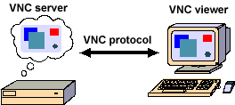
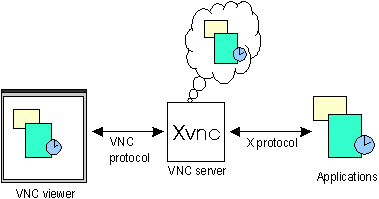

# VNC

## 简介

VNC (Virtual Network Computing) 为一种使用 RFB 协议的屏幕画面分享及远程操作软件，通过网络，可发送键盘与鼠标的动作及即时的屏幕画面。

## 历史与现状

VNC 由 Olivetti & Oracle 研究室所开发，此研究室在1999年并入 AT&T。AT&T 于2002年中止了此研究室的运作，并把 VNC 以 GPL 发布。

原来的 AT&T 版本已经不再使用，因为更多有重大改善的分支版本已经出现，他们具有全面的向后兼容。由于 VNC 以 GPL 授权，派生出了几个 VNC 软件：

- RealVNC：由VNC团队部分成员开发，分为全功能商业版及免费版。
- TightVNC：强调节省带宽使用。
- UltraVNC：加入了 TightVNC 的部分程序及加强性能的图型映射驱动程序，并结合 Active Directory 及 NTLM 的账号密码认证，但仅有 Windows 版本。
- Vine Viewer：macOS 的 VNC Client.

这些软件各有所长，例如UltraVNC支持文件传输以及全屏模式。而这些软件间大多遵循基本的VNC协议，因此大多可互通使用。

Windows Server 中包含的 Terminal Server、Symantec 公司开发的收费软件 PCAnywhere、流行的 Teamviewer 的设计原理和 VNC 相似，同时这些软件又在 VNC 的原理基础上做了各自相应改进，提高了易用性、连通率和可穿透内网的特性。

## 原理

VNC 系统由 Client, Server 和一个协议组成。

VNC 的 Server 目的是分享其所运行机器的屏幕， Server 被动的允许 Client 控制它。VNC Client 观察、控制 Server, 与 Server 交互。VNC 协议 RFB 是一个简单的协议，传送 Server 的原始图像到 Client （一个 X,Y 位置上的正方形的点阵数据），Client 传送事件消息到 Server。

Server 发送小方块的帧缓存给 Client，在最简单的情况，VNC协议使用大量的带宽，因此各种各样的方法被发明出来减少通讯的开支，举例来说，有各种各样的编码方法来决定最有效率的方法来传送这些点阵方块）。

协议允许 Client 和 Server 协商哪种编码会被使用。最简单的编码，即被所有 Client 和 Server 所支持的是，从左到右的像素扫描数据的原始编码，当原始的满屏被发送后，只发送变化的方块区域。这种编码在幁间只有小部分屏幕变化的情况下工作的非常好（像是鼠标键在桌面移动的情况，或在光标处敲击文字），不过如果大量的像素同时变化，带宽消耗将会增加的非常高，例如拖动一个窗口或观看全屏录像。

VNC 默认使用 TCP 端口5900至59066。一个 Server 可以在5900端口用“监听模式”连接一个 Client, 使用监听模式的一个好处是 Server 不需要设置防火墙。

**UNIX 上的 VNC 称为 xvnc，同时扮演两种角色：对 X Window System 的应用程序来说它是 X Server，对于 VNC Client 来说它是 VNC Server.**

## 优点

- VNC Client 不储存任何状态信息，使得在任何地方连接到 VNC Server 时都可以得到完全一致的状态。

- VNC Client 是平台无关的，在各个平台上的使用体验一致，可用于数量庞大的不同操作系统。多平台的支持对网络管理员是十分重要的，这使得网络管理员可以使用一种工具管理几乎所有系统。

- VNC 是免费的，它的简单，可靠，和向后兼容性，使之进化成为最为广泛使用的远程控制软件，

## 缺陷

- 带宽占用大，对于动态内容较多的画面，会有明显的延迟和帧率下降。

- VNC 对于简单的远程控制几乎完美，但是缺少对于大机构的桌面帮助功能，主要是日志记录和安全功能没有足以达到此目的。VNC为远程工作人员或受客户机也没有做好准备，因为当前还没有支持远程应用程序的本地打印。

- 因为 VNC 本来是开发用在局域网的环境，因此用在互联网上存在安全问题。不过 VNC 可设计以 SSH 或 VPN 传输，以增加安全性。有些 VNC 软件，如 UltraVNC，更进一步支持 Active Directory 及 NTLM 的账号密码认证。

## VNC, XVNC 与 X11vnc

XVNC 同时具有 X Server 和 VNC Server 的功能。可以在没有物理显示器的情况下渲染 X System 的画面，并使用与一般 VNC 一致的技术手段传送给 VNC Client.

X11vnc 仅抓取正在运行的 X System 的画面，自身并没有渲染的功能，和 VNC 没有实质性的区别，但对进行了安全强化，引入了 SSL 连接等实用的安全特性。

## VNC 的有关改进

### 1. 提高客户端屏幕显示的帧率

作为一款远程做桌面的产品，屏幕画面显示是否卡顿永远都是最重要的用户体验。因此，提高客户端上屏幕显示的帧率就至关重要。

#### 1.1 屏幕更新策略

屏幕更新策略主要涉及到下面两个问题：

- Server 端如何检测出屏幕画面发生了变化并生成显示更新？
- Server 端何时将显示更新发送到 Client 端？

下面就对这两个问题进行一个简单的分析：

##### 1.1.1 显示更新的生成
这个问题的本质其实是显示更新与当前系统窗口系统的绘图命令之间的关系。在 Server 端可以采用来两种策略来生成显示更新：

积极更新策略（Eager display update）
懒惰更新策略（Lazy display update）
在积极更新策略中，一旦窗口系统发出新的图形命令,Server 端都立刻生成该命令对应的显示更新。

而在懒惰更新策略中，窗口系统产生的图形命令会被首先放入一个中间队列,以检测各条命令所更改的区域是否存在重合，在存在重合的情况下将对相关命令进行合并后为其生成显示更新。

懒惰更新由于可以对多个显示更新进行合并，在带宽利用上更有优势。然而懒惰更新并不适用于对交互性要求较高的应用。

##### 1.1.2 显示更新的驱动模式
显示更新的驱动模式指的就是何时将 Server 端的显示更新发送到 Client 端，这里存在两种显示更新的驱动模式：

- 服务端主动推送（Server-Push）
- 客户端主动拉取（Client-Pull）

在 Server-Push 的模式中，由 Server 端决定何时将生成的显示更新发送到 Client 端。而在 Client-Pull 模式中，Client 端在需要显示更新时向 Server 端发送请求，驱动着 Server 端返回更新。

Client-Pull 模式的优势在于它是一种简单且易于实现的模式，并且整个系统具备一定的自适应能力，Client 端能够根据自身处理能力、网络状况对发送请求的频率进行调整。

#### 1.2 VNC 中的屏幕更新策略
在 VNC 中实现的屏幕更新策略是客户端主动拉取式的懒惰更新策略。由于 VNC 是从 Framebuffer 层截获系统原始的屏幕像素数据，所以这一特点也决定了 VNC 只能采用懒惰的更新策略。而在显示更新驱动模式上，VNC 则采用了实现更为简单并能够根据网络状况来修改发送屏幕更新请求频率的客户端拉取的更新策略。

但是 Client-Pull 的显示更新驱动模式存在一个明显的缺陷：相邻的显示更新之间存在不可消除的时间间隔，如果在传输延迟比较大的情况下，Screen update time 的值就会变得很大，就会导致客户端屏幕显示的帧率下降出现卡顿的情况，用户体验变得很差。

### 2. 改进图像修改区域检测算法

VNC 中的 RFB 协议所支持的屏幕像素数据的更新方法是一种增量式的数据更新方法。整个屏幕的像素数据被切分成一个个更小粒度的矩形块（我们将其称为检测矩形块），当 Client 端第一次发送 FramebufferUpdateRequest 给 Server 端时，Server 端会将 整个屏幕像素数据发送给 Client 端，而当 Client 端接下来再次发送 FramebufferUpdateRequest 消息时，Server 端只需要将与上一帧屏幕图像不同的作了修改的部分的矩形块进行压缩编码重传即可，这种方法有效地节省了数据地传输。

但是，计算屏幕图像修改区域需要花费额外的计算时间，因此，图像修改区域检测算法就是用来缩短这一段计算时间。修改区域检测算法所需要做的事情就是找出当前屏幕图像和上一帧图像之间存在差异的地方。

#### 2.1 传统的基于屏幕扫描顺序的检测算法

传统的图像修改区域检测算法是按照屏幕地扫描更新顺序（从左上角到右下角的顺序），依次对比当前帧图像和上一帧图像图像在同一个坐标位置的像素值，如果像素值不相同，那么则将这个像素点所在的矩形块标记为“脏矩形块”。

从这个检测算法的工作机制中我们就可以看出这种算法的工作效率不高，当修改了的像素点位于矩形块的右下角时，那么这个算法会对矩形块中的每个像素点做一个对比。因此，韩国的研究人员提出了下面的两种改进方案。

#### 2.2 分层修改区域检测算法

这个算法的核心思想就是使用不同大小的采样矩形来检测采样矩形中是否存在相对于上一帧图像做了修改了的像素点，由于整个算法是按照二维进行展开搜索的，它相对于传统的按照一维顺序扫描检测算法快地多。整个算法可以分为 3 个步骤:

- step 1 首先，采用矩形的长和宽分别被设置成检测矩形大小的 1/4，然后在这个小的采样矩形块中采用传统的按照屏幕扫描顺序来依次对比其中的像素点是否发生了变化，如果是，那么整个算法停止，当前的检测矩形块就被标记为“脏矩形块”。否则，算法就接着执行下面的 step 2。

- step 2 在这一步中，采样的矩形块的长宽分别被设置成检测矩形的 1/2，然后和 step 1 一样还是采用传统的按照屏幕扫描顺序来依次对比其中的像素点的方法来检测是否有像素点发生了变化。如果是，那么整个算法停止，当前的检测矩形块就被标记为“脏矩形块”。否则，算法就接着执行下面的 step 3。

- step 3 在这步中，采样的矩形块的长宽分别被设置成和检测矩形一样的大小，后面的像素点的比较算法就和 2.1 小节中描述的传统的像素点扫描检测算法相同。

如果这种算法能够在 step 1 和 step 2 两步中停止下来，那么该算法的的效率就会比 2.1 小节的传统检测算法高，否则直到 step 3 时算法才停止的话，该算法的效率就和传统的检测算法效率一样了。

#### 2.3 间隔扫描检测算法

这种算法的核心思想也非常简单，简单描述一下就是：先按照 1,3,5,7…… 这样的奇数顺序，按照传统的扫描检测算法来对指定位置的像素点的像素值依次比较，如果发现有像素点相对于上一帧图像发生了变化，那么算法就停止，当前的检测矩形块就被标记为“脏矩形块”。否则的话，下一轮扫描就是按照 2,4,6,8…… 这样的偶数顺序来进行检测，发现有像素点相对于上一帧图像发生了变化，那么算法就停止，当前的检测矩形块就被标记为“脏矩形块”。如果还是没有发现修改的像素点，那么这个检测矩形就不会被标记为“脏矩形块”，在后续的处理中就会被跳过。

### 3. 压缩编码算法

我们知道 VNC 中传输的数据量最大的就是屏幕数据，当网络带宽有限时，屏幕数据从 Server 端传送到 Client 端就非常容易发生拥塞，导致客户的屏幕更新率降低。因此，减少 VNC 传输的数据量就变得非常重要。而想要减少 VNC 传输的数据量，就要依赖于一个好的压缩编码方法。

在 VNC 协议中已经内置了以下几种压缩编码的方法：

- Raw
- CopyRect
- RRE
- Hextile
- ZRLE

有关这些编码的具体含义，可以参考 RFB 协议中描述。

但是，由于上述几种压缩编码算法的压缩率和编码时间可能无法达到非常理想的状态，所以就有许多研究人员采用 Zlib、MPEG2、MPEG4、MJPEG 等库来对传输的图形数据进行压缩编码.
