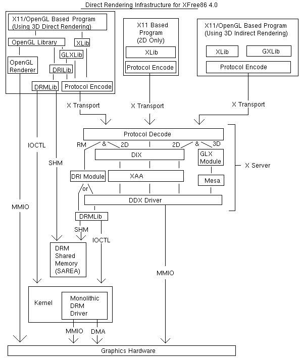

# Xjs 调研报告

## 项目成员

刘紫檀 张博文 虞佳焕 汤兖霖

## 项目简介

本项目意在实现一个主要基于浏览器 Javascript 的 X Server，用来提供一种更流畅的远程桌面方案。

## 项目背景

目前直接利用 Web 方案下的远程桌面大多是基于帧传输，无法如`Xming`等基于 X11 协议的 X Server 程序一样提供近似原生桌面的帧率体验和操作感受。

同时，随着计算机系统性能和浏览器图形图像渲染能力的提升，我们认为，可以通过将要绘制内容的**方法**而不是**结果**实时回传，从而降低延迟，提高帧率，实现更流畅的 Web 远程桌面体验。

## 立项依据

我们调研了用于实现 Web 上动态绘图和双工传输的常见组件，以及常见的远程桌面与 X 的解决方案。下面将逐一进行介绍。

### 常见的远程桌面协议

#### RDP

RDP（*Remote Desktop Protocol*），是微软开发的一个专有协议。

据[RDP @ Wikipedia](https://en.wikipedia.org/wiki/Remote_Desktop_Protocol)介绍，RDP 是基于「行为」而非基于帧的；但由于文档缺乏刘紫檀同学没能考证。可以详见[rdesktop](https://github.com/rdesktop/rdesktop)中关于 RDP 的实现。

#### VNC

VNC（*Virtual Network Computing*）是基于*Remote Framebuffer*（以下简称`RFB`）协议的一个远程桌面连接协议。

在[RFC6143](https://tools.ietf.org/html/rfc6143)可以看到`RFB`协议的内容。

>
>
> 7.4.  Pixel Format Data Structure
>
>   Several server-to-client messages include a PIXEL_FORMAT, a 16-byte
>   structure that describes the way a pixel is transmitted.
>
>             +--------------+--------------+-----------------+
>             | No. of bytes | Type [Value] | Description     |
>             +--------------+--------------+-----------------+
>             | 1            | U8           | bits-per-pixel  |
>             | 1            | U8           | depth           |
>             | 1            | U8           | big-endian-flag |
>             | 1            | U8           | true-color-flag |
>             | 2            | U16          | red-max         |
>             | 2            | U16          | green-max       |
>             | 2            | U16          | blue-max        |
>             | 1            | U8           | red-shift       |
>             | 1            | U8           | green-shift     |
>             | 1            | U8           | blue-shift      |
>             | 3            |              | padding         |
>             +--------------+--------------+-----------------+
>

> 7.5.  Client-to-Server Messages
>
>   The client-to-server message types defined in this document are:
>
>                   +--------+--------------------------+
>                   | Number | Name                     |
>                   +--------+--------------------------+
>                   | 0      | SetPixelFormat           |
>                   | 2      | SetEncodings             |
>                   | 3      | FramebufferUpdateRequest |
>                   | 4      | KeyEvent                 |
>                   | 5      | PointerEvent             |
>                   | 6      | ClientCutText            |
>                   +--------+--------------------------+

> 7.6.  Server-to-Client Messages
>
>   The server-to-client message types defined in this document are:
>
>                      +--------+--------------------+
>                      | Number | Name               |
>                      +--------+--------------------+
>                      | 0      | FramebufferUpdate  |
>                      | 1      | SetColorMapEntries |
>                      | 2      | Bell               |
>                      | 3      | ServerCutText      |
>                      +--------+--------------------+

可以看到，`RFB`协议非常简单，作为基于帧的协议也没有提供很多功能。很多 VNC 客户端都在`RFB`协议上做了有限的扩展，以增强其功能；但是 VNC 客户端之间的互操作性也随之下降。

### `X Window System`

#### 概述

X Window System （下面简称为 X）是一个基于客户端/服务器模型的 GUI 框架，被广泛应用于 Unix 系统中。诸如 Chromium 这样的 GUI 软件作为 X 客户端，通过 X11 协议连接 X 服务器。典型的 X 服务器（如`Xorg`）负责根据 X 客户端的指示绘制图形，接收用户从键盘、鼠标的输入并且分发到对应的 X 客户端。

X 起源于1984年的 MIT 实验室。最新的 X 协议版本为 X11 Revision 7.7，但是 X11 的第一个版本早在1987年九月就已成型。X 提供了用于构建 GUI 程序的基本框架，例如处理哪个程序应该更新显示，以及鼠标键盘事件应该送往哪里。

不过，X 并没有关于界面本身的统一标准，而是把这种画界面的工作下放给了诸如 Gtk、Qt 等 Toolkit 来实现。这样做导致运行在 X 上的应用程序样式可谓五花八门。

X 的协议实现了网络透明，这意味着一个运行在另一台电脑上的 X 客户端程序可以连接到这台电脑的 X 服务器上来显示它的界面，并且可以和本地的 X 客户端程序达到相同的功能。这对于我们实现基于 Javascript 的浏览器端 X 服务器是极为有用的。

X 没有对音频系统的内建支持；对于音频系统，常用的组件是`PulseAudio`。`PulseAudio`是一个通用的 Linux 音频服务端软件。在此之下驱动声卡的系统组件则是`alsa`。

#### X 的设计哲学
在1984年，Bob Scheifler 和 Jim Gettys 提出了 X 的早期设计哲学：
- 不到实现者没法实现功能的程度，就不要添加新功能。
- 决定系统「不是什么」和决定它「是什么」一样重要。不要尝试去满足所有需求，而应该让系统有良好的扩展性，这样其它需求就可以用向上兼容的扩展来达到。
- 没有什么比只从一个孤例总结观点更糟了。如果有，那就是一个例子也没有的总结。
- 如果可以用 10% 的工作完成 90% 的事情，那就这样做。
- 尽可能隔离复杂性。
- 提供「机制」而非「策略」。特别地，把用户界面的实现策略交给客户端手上。

在 X11 时第一条变成了「如果你不知道有什么实际的应用场景，就不要添加新功能」。

X 贯彻这些哲学贯彻的非常彻底。渲染和窗口管理上的变动基本通过添加扩展实现，而协议本身仍然与1987年的 X11 保持兼容。

#### X 的缺陷和取代 X 的尝试

X 基于的客户端/服务器架构隔离了不同硬件和不同设备带来的复杂性，但是也降低了程序运行速度，增大了图形界面的开销。同时，X11 本身没有对一个程序抓取另一个程序的输入事件的行为作出限制，这带来了一些安全上的问题。

X 的竞争者主要为`Wayland`。`Wayland`相比于 X 有如下优势：

#### 核心 X 协议概述

X 负责管理 *Display* 和 *Screen*。

当连接 X 服务器时，用户必须选择连接到哪个 *Display*。通过 `$DISPLAY` 或者 `-display`/`--display` 可以更改。`DISPLAY`的详细格式可以参考 X(7) 手册页。简略的讲，可以用`hostname:display.screen`；本地连接可以省略`hostname`，`.screen`如果采用默认 screen 也可以省略，得到类似`:0`的`DISPLAY`变量值。

*Graphics contents*: 用于存储 X 绘图过程中的共享状态和共用值的结构。可以避免每次重复发送相同的参数。

X 的绝大多数操作都是异步的，包括很多渲染操作。这些异步操作会先压在缓冲区里面，直到缓冲区满或触发flush操作。

X 核心协议的全部 Request 和 Event，请参见[X11ReqAndEvents](X11ReqAndEvents.md)。

查看可用字体（Via `fontconfig`）：`fc-list :lang=zh`

#### X11 核心协议分析

请参见[X11Protocol](X11Protocol.md)

#### Composite

#### 数据流

X 的数据流：



[DRI Control Flow](http://dri.sourceforge.net/doc/dri_control_flow.html)

#### 配置 X 使用 TCP 连接

X 协议本身只需要一个用于客户端/服务器的流式协议。在普通的桌面应用中，`Xorg`都被配置为使用`Unix Domain Socket`（通过`/tmp/.X11-unix/X0`等套接字文件或者直接使用`Abstract Socket`）的方法和客户端通信。

不过，`Xorg`也可以配置为使用 TCP 协议。配置如下：
```bash
# 测试环境 xorg-server 1.20.4-1 & xorg-xinit 1.4.1-1 @ Archlinux amd64

# 首先修改 xserverrc，把 Xorg 选项中的 -nolisten tcp 去掉
sudo vim /etc/X11/xinit/xserverrc

# 然后把现在有的 X 进程关掉，在我这里只需要关掉 lightdm
# 在此之前请先切换到一个 vt（比如 Ctrl-Alt-F2），而不是在 GUI 的终端模拟器搞
sudo systemctl stop lightdm.service

# 然后，只要用 xinit 打开一个监听 TCP 的 Xorg Server就可以了
# 懒得搞权限，直接 sudo；其实不是啥好习惯
# xinit 中 -- 后面的是要传给 Xorg 的参数；之前似乎不用，但是现在必须要显式指定监听 TCP 才会监听
# 我这里用的是 Xfce 桌面环境，请调成自己的session环境。
sudo xinit xfce4-session -- -listen tcp

# 现在你应该有一个可用的 Xfce 桌面了。对于我来说，这个桌面的 TCP 端口经常绑定在 6001
# 如果不确定是哪个端口，请用 netstat 等工具查看一下
# 但是在我这里，程序还是会默认采用 Domain Socket；这对于实验 X 协议也不失为一件好事。
# 现在如果想要让某个 X Client 通过 TCP 600X 和 Xorg 通信，只需要在终端中改变环境变量，然后运行
export DISPLAY=localhost:X # 此处X为一位数字，请替换
xeyes # 此处可以直接运行程序

# 在运行程序之前可以先打开一个 Wireshark 监听 loopback 端口上的通信。
# Wireshark 有内置解包 X11 协议的插件，非常方便。
```

#### X 抓包分析

经过一些（不严谨的）测试，X11的平均流量如下：
- Xeyes: 12 KiB/s
- VLC Media Player，播放高清视频：13 MiB/s 
- Chromium，正常操作: 1~2 MiB/s

在后两者中大量用到了 PutImage 方法，可能是带宽占用大的元凶。可以考虑 PutImage 方法中转时进行压缩。

### HTML5 Canvas & Websocket
[Websocket Research Report](Websocket.md)

[Canvas Research Report](Canvas.md)

### Perf. about Javascript
[Canvas Research Report](Canvas.md)

## 相关工作

### Xming

Xming 是 X server 在 Windows 上的一个实现，支持 GLX 3D 显示扩展。Xming 通过配合 SSH 的远程桌面转发功能（`X11 Forwarding`)，可以实现运行远程 Unix 主机上的 X 客户端程序。

### XNest/Xephyr
XNest 和 Xephyr 是两个作为 X11 Client 的 X Server。

### x-server-js
基于 NodeJS & Browser JS 的 X Server 实现。

URL: [x-server-js @ Github](https://github.com/ttaubert/x-server-js)

最后一次提交：2013年9月16日

代码量：1466 行 (考虑到`bundle.js`是其它文件的简单合并，略去)

```bash
# 假设已经安装好 NodeJS, npm 和 git
git clone https://github.com/ttaubert/x-server-js.git
cd x-server-js
npm install websocket # 提醒：用 NodeJS 淘宝源可以加速；npmjs.org 慢的够呛
node x-server.js

# 然后在浏览器打开 example/index.html

# 建立 WebSocket 连接之后再运行 X11 Client，否则会报错（无力吐槽）
export DISPLAY=localhost:1 # depending on the listening port, localhost:X for port 600X
xeyes

```

利用 NodeJS 在远程机器处进行 X11 Protocol - WebSocket 转发；在浏览器上实现解析 X 请求并且进行显示，与本项目设计基本相符。

但是，项目完成度很不理想，目前仅实现了`xeyes`和`xlogo`程序所需的全部调用（共21个）；`x-server.js`中也是多处TODO。

### javascript-x-server
基于 NodeJS & Browser JS 的 X Server 实现。

URL: [javascript-x-server](https://github.com/GothAck/javascript-x-server)

最后一次提交：2015年

代码量：14090 行（不包括外部库`node_modules`文件夹）

不知道为什么，刘紫檀同学没能按照`README.md`运行成功...

按照主页描述，比较`x-server-js`，多了`xft`等需要 X 字体系统的支持的功能。猜测可能在服务器端渲染并且回传（？）

### 基于 NodeJS 的客户端实现

- [ntk](https://github.com/sidorares/ntk)
- [node-x11](https://github.com/sidorares/node-x11/)

两个项目都提供了一些使用 NodeJS 写 X11 客户端的类库。开发比较活跃。

## 前瞻性/重要性分析

相对于基于帧的远程桌面客户端(例：Vnc)的优势：
- 容易实现更高帧率，体验更好。
- 对于部分应用可以优化带宽占用。

相对于Xming等X11 Server的优势：
- 无需安装，部署快捷。
- 更加轻量。
- （可选的）服务器端转发中压缩，实现更低带宽占用。

